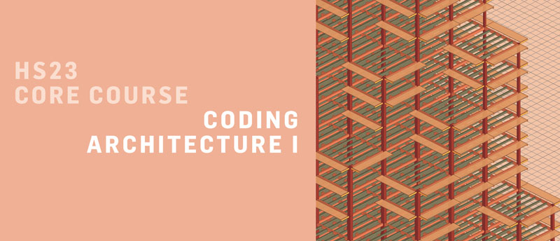

# Coding Architecture I: HS23

Materials for the "Coding Architecture I", Autumn Semester 2023.

> Coding Architecture I-II 
> is a **programming class for architects** 
> with particular focus on **demystifying technology**
> -both software and hardware- 
> **and exploring the programmability of our world** 
> through powerful methods of digital, computational, and algorithmic design.

## Getting started

See [here](getting-started/README.md) for details about software requirements and installation of the tools.

## Course information

The central platform for all course content is [Moodle](https://moodle-app2.let.ethz.ch/course/view.php?id=20309).

## Lectures

* [Week 01](examples/week-01/README.md) | [Ungraded assignment](assignments/ungraded-assignment)
* [Week 02](examples/week-02/README.md) | [Assignment 01](assignments/A01-area-checker/README.md)
* [Week 03](examples/week-03/README.md) | No assignment
* [Week 04](examples/week-04/README.md) | [Assignment 02](assignments/A02-filtered-point-grid/README.md)
* [Week 05](examples/week-05/README.md) | No assignment
* Week 06:  Seminar week
* [Week 07](examples/week-07/README.md) | [Assignment 03](assignments/A03-building-grid/README.md)
* [Week 08](examples/week-08/README.md) | No assignment
* [Week 09](examples/week-09/README.md) | No assignment

## Roadmap

See [here](roadmap/README.md) for the **Roadmap: becoming a computational designer**,
that provides guidance during the learning process and helps you understand how much
you've progressed and what are the skills and concepts that you should master in order
to move forward.
