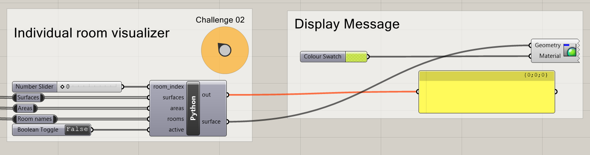

# Assignment 01

> Goal: apply conditional logic, understand lists, sorting of lists, list indexing, and some basic built-in functions.

## Main task

Use conditional statements to determine if the area of each room is within
min and max values, define meaningful values here based on the room name.

#### Details

- Assign variables min_area and max_area to meaningful minimum and maximum area
  requirements in square meters based on the room_name input parameter
- Verify if the room_name is within the boundaries and assign the
  variable color_output accordingly:
    - If the provided area is smaller than the minimum, output Color.Red.
    - If the provided area is larger than the maximum, output Color.Maroon
    - For all other cases, output Color.Green
- Generate a text_tag variable for the room using the room name and the
  rounded area (eg. "Living Room: 25.50 m2")
- Use the provided visualization components in Grasshopper to display
  the results on the floor plan.

#### Bonus

Use the ".lower()" function of strings to ensure that your code
is case-insensitive (ie. that "Kitchen" will also match "KITCHEN")

#### Functions, methods and statements that you will need

- if..elif..else conditional statements
- round() for neatly formatted area values
- print() to create the output messages
- string concatenation or string.format() to nicely format messages

---

## Challenge 01

Print out one message per line with the room name and area in square meters 
making sure the results are sorted by area size from smaller to larger.

#### Bonus

Make sure the formatting of the areas is neatly limited
to a maximum of 2 decimal points only

#### Functions, methods and statements that you will need

- for loop iteration statements to iterate over all rooms and areas
- sorted() to sort the results
- zip() to have matching area-to-room pairs
- round() for neatly formatted area values
- print() to create the output messages
- string concatenation or string.format() to nicely format messages

---

## Challenge 02

Allow the user to visualize rooms individualy by selecting
them from an input slider or value list. Allow the user to toggle
the visualization on and off.

#### Details

- Create the following input parameters:
    - room_index (item access, integer)
    - surfaces (list access)
    - areas (list access)
    - rooms (list access)
    - active (item access, boolean)
- If the input "active" is set to False, don't do anything
- If it is set to True, select and display information about the
  corresponding room, including visualizing the room surface
  and its area in square meters.
- Use the provided visualization components in Grasshopper
  to display the output of this component.

#### Functions, methods and statements that you will need

- if statement
- list indexing
- print() to create the output messages
- round() for neatly formatted area values
- string concatenation or string.format() to nicely format messages

## Deliverables

One zip file [`mustermann_max_A-01.zip`] containing:

- Rhino File (`.3dm`):
  - File Name: `mustermann_max_A-01.3dm`
- Grasshopper File (`.ghx`):
  - File Name: `mustermann_max_A-01.ghx`
- Screenshots (`.png`):
  - File Name: `mustermann_max_A-01_xx.png`
  - Dimensions: 3200x2400 px
  - View: Top - Rendered
  - Background: white

## Submission

Upload the assignment via Moodle.