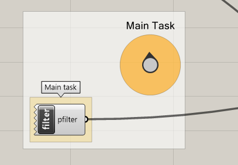

# Assignment 02

> Goal: apply object-oriented programming to the filtered 3D grid.

#### Main task

Create a new kind of filter by implementing a new class. Use the examples above 
as inspiration. Your new filter class should have one method `is_included`
that takes 3 parameters as input: `x`, `y`, `z` and returns `True` or `False` as output
indicating whether the specific point should be included or not in the final result.

The filter should be mathematically-defined, implementing **the paraboloid function**.

#### Details

- Create a class, eg. `ParaboloidFilter`.
- Add a method `is_included` to it. This method should return `True` if the
  criteria of the current `x`, `y`, `z` input parameters match, otherwise `False.`
- Right below the class, create an instance of it and assign it to the output of this
  component.
- Plug the component to the `Stream filter` one in order to test it.

#### Bonus

- Add a `__str__` magic method that returns a string describing the filter in a nice way.

#### Functions, classes, methods and statements that you will need

- Class definition.
- A class constructor (`__init__`).
- Attributes of a class. For a paraboliod filter, you might need to 
  store the shift in X and Y and a coefficient as attributes.

---

## Challenge 01

Visualize the point grid using boxes instead of points. For each points in the
filtered grid, create a `Box` instance. Each box should be placed in space where the point is.
Use the `xsize`, `ysize`, `zsize` sliders to determine a size that matches the spacing of the grid.
Connect to the COMPAS component to display the geometry on the Rhino viewpoint.

#### Details

- Connect the `xsize`, `ysize`, `zsize` sliders as inputs.
- Iterate over all points.
- Create a box using `from_corner_corner_height`.
- Append to a list.
- Assign the list of boxes to an output parameter.

#### Bonus

- Explore the API documentation of COMPAS and use another method to create the boxes.

#### Functions, methods and statements that you will need

- `Box` class from `compas.geometry.Box`.
- `Box.from_corner_corner_height` method to create instances.
- `Point` class to create new points for the second corner of the box.
- `.append()` method of a list to create the list of all boxes.

---

## Challenge 02

Allow to create a filter that is the combination of two or more filters (ie. sub-filters).
The new filter class could combine them using an **OR GATE** or an **AND GATE**,
ie. the `is_included` method returns `True` as soon as any of its sub-filters returns `True`,
or alternatively, it could return `True` only if all its sub-filters returns `True`.

The logical **OR GATE** and **AND GATE** are concepts of Grasshopper, and they simply mean
"True if any condition is true" and "True if all conditions are true" respectively. 

- Example of OR GATE in Python: `room == "bedroom" or room == "kitchen"`
- Example of AND GATE in Python: `area > 10 and area < 40`

#### Details

- Create a class, eg `ORGateMergeFilter`.
- Add a constructor (`__init__`) taking `subfilters` as parameter.
- Add the method `is_included` and implement **OR GATE** logic to return
  `True` as soon as any of the subfilters returns `True`.

#### Functions, methods and statements that you will need

- Class definition.
- `if` statement.
- Class attributes containing complex types. 

## Deliverables

One zip file [`mustermann_max_A-01.zip`] containing:

- Grasshopper File (`.ghx`):
  - File Name: `mustermann_max_A-01.ghx`
- Screenshots (`.png`):
  - File Name: `mustermann_max_A-01_xx.png`
  - Dimensions: 3200x2400 px
  - View: Top - Rendered
  - Background: white

## Submission

Upload the assignment via Moodle.