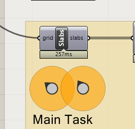
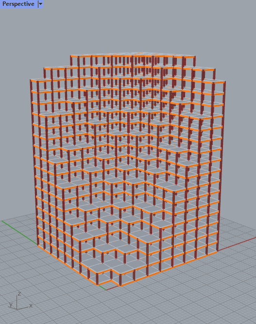
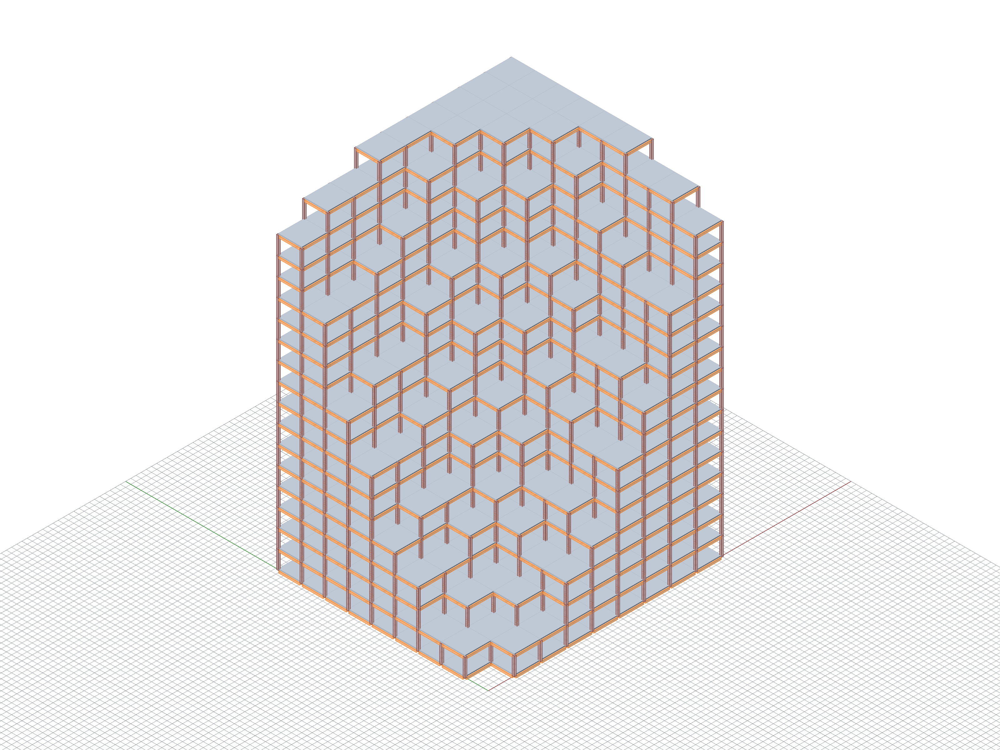
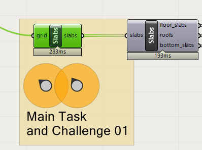
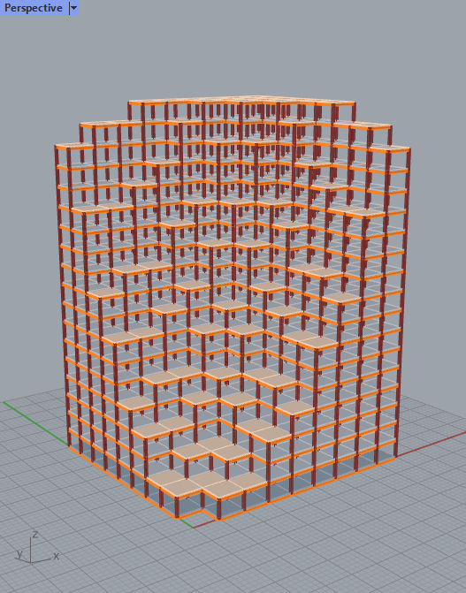
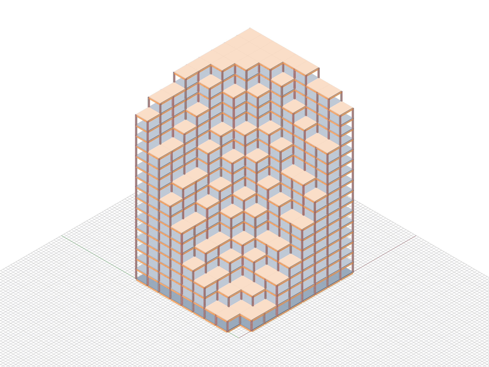
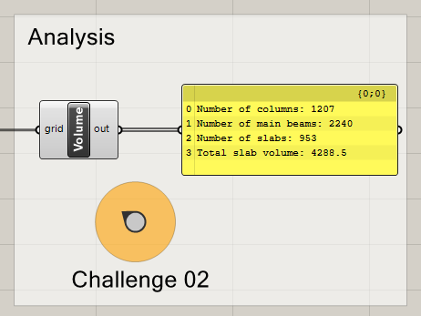

# Assignment 03

> Goal: apply object-oriented programming to the create slabs in our building grid.

We are picking up from where we left off in our last tutorial file of week 05 and expanding from there.
You can also include your custom filter from assignment 02 if you want although that doesn't change the grade.

The starting point for your assignment is this [Grasshopper definition](A03-building-grid-slabs.gh)

## Main task

Goal: Create slabs for our building grid.

A slab is represented visually as a box (using `compas.geometry.Box`).
The basic idea is to rely on the volmesh to know where to add each slab.
We will create one slab per each face of our grid's volmesh if the face is 
aligned to the XY plane (ie. flat).

We will create a Slab class that will contain the attributes and methods of each slab.
The Slab class needs two attributes: shape (a box), and function (a string).
Function will only be used if you tackle challenge 01. Otherwise you can ignore it.

#### Details

The algorithm that we need to implement, as well as hints to functions you might need,
is in code comments, as a step-by-step guide.

---

## Challenge 01

Goal: Assign the function of each slab

Each slab can be assigned one of three different functions: "roof", "floor_slab" or "bottom_slab". 

#### Details

The algorithm that we need to implement, as well as hints to functions you might need,
is in code comments, as a step-by-step guide.

---

## Challenge 02

Goal: Calculate and print total volume of slabs, and the number (amount) of each element type (slabs, columns and main beams).

The methods to get the numbers of columns and mainbeams already exist on the BuildingGrid class so we can print them out directly.
A new method number_of_slabs() needs to be added to the BuildingGrid class.

A new method to calculate the volume of each slab needs to be added to the Slab class.

#### Details

The algorithm that we need to implement, as well as hints to functions you might need,
is in code comments, as a step-by-step guide.

## Deliverables

One zip file [`mustermann_max_A-03.zip`] containing:

- Grasshopper File (`.ghx`):
  - File Name: `mustermann_max_A-03.ghx`
- Screenshots (`.png`):
  - File Name: `mustermann_max_A-03_xx.png`
  - Dimensions: 3200x2400 px
  - View: Parallel, Shaded
  - Screenshots of the main task and challenge 01, for challenge 02 is not relevant.

## Submission

Upload the assignment via Moodle.