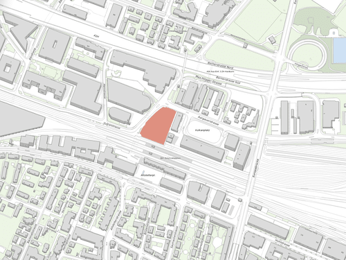
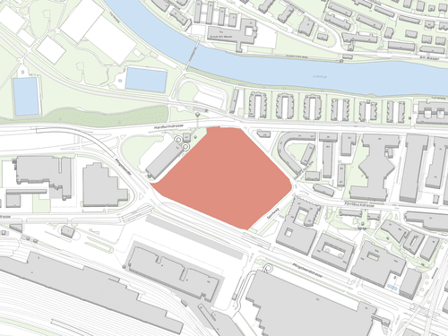
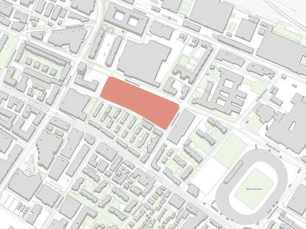
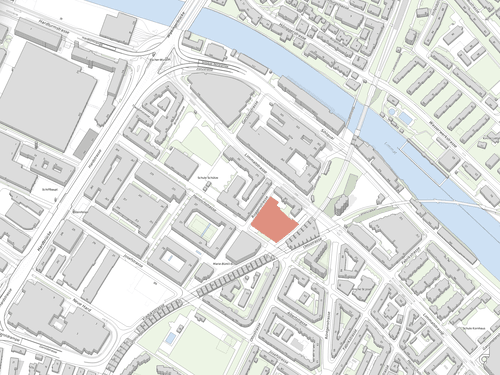
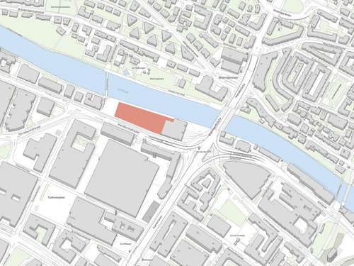

# Final project

> Goal: integrate all knowledge gained during the assignments into a more complete building structure.

## Project Overview

Use Python programming to create a building structure that is sculpted by a filter class,
incorporating architectural components like slabs, columns, and facade walls.

The building is to be placed in a real 
Choose one of the following five plot locations in Zürich for your building design project:
**Altstetten**, **Hardturm**, **Letzi**, **Heinrich-Areal**, **Escher Wyss**.

Each location has its unique characteristics and potential constraints.
Consider factors like plot size, shape, and local context when making your choice.

### **Altstetten**

 * [Link to Map](https://maps.app.goo.gl/dQk7bScDTtiNCmL29)
 * Area: approx. 6'100 m2
 * Close to the train station, high-rise building with a mixed-use potential.
 * [Site project reference](https://www.tagesanzeiger.ch/ubs-will-in-altstetten-gruenes-108-meter-hochhaus-bauen-936800059229)

### **Hardturm**

 * [Link to Map](https://maps.app.goo.gl/hJKiF5C4hsGWo2ug6)
 * Area: approx. 39'300 m2
 * Large area! Think about the balance between built and open spaces. Multiple buildings: low-rise with courtyards, high-rise buildings etc. or alternative ideas to the stadium are welcome.
 * [Site project reference](https://projekt-ensemble.ch/einblicke-ins-projekt/stadtentwicklung-ist-ein-kollektives-experiment-im-gesellschaftlichen-labor/)

### **Letzi**

 * [Link to Map](https://www.google.com/maps/search/Letzi/@47.3853014,8.4978238,357m/data=!3m1!1e3?entry=ttu)
 * Area: approx. 7'800 m2
 * An area with upcoming residential towers; consider increasing density.
 * [Site project reference](https://galli-rudolf.ch/projects/Hochhaus-Baslerstrasse)

### **Heinrich-Areal**

 * [Link to Map](https://www.google.com/maps/search/Heinrichareal/@47.3881218,8.5250139,211m/data=!3m1!1e3?entry=ttu)
 * Area: approx. 4'000 m2
 *  A small plot with unique challenges. Blockrand typology might be interesting.
 * [Site project reference](https://competitions.espazium.ch/de/wettbewerbe/decisi/heinrich-areal)

### **Escher Wyss**

 * [Link to Map](https://www.google.com/maps/@47.3916348,8.5209248,369m/data=!3m1!1e3?entry=ttu)
 * Area: approx. 6'700 m2
 * An evolving district with a growing demand for affordable residential space.
 * [Site project reference](https://www.stadt-zuerich.ch/hbd/de/index/hochbau/bauten/bauten-geplant/tramdepot-und-wohnsiedlung-depot-hard.html)

---

## Required tasks

The following tasks are required to complete the final project successfully. Completing them correctly awards 4 grade points. The maximum grade for this assignment is 6 points. The remaining 2 points can be obtained by completing the extra tasks.

### 1. Project presentation: poster in PDF

Prepare a single-page poster showcasing the project and the outputs of your code.

Guidelines:

- Brief description of your design. Can highlight concept, challenges faced, and discoveries made during the project.
- Main image of the project: rendered on white background without grid.
- Optionally 2 or 3 additional images of the project
- Use Landscape orientation

See [sample poster for reference](A04-sample-poster.pdf)

### 2. Sculpt your building using a filter

Use at least one `Filter` class to shape your building.

### 3. Color elements

Use different colors to distinguish between different architectural elements or to represent specific materials.

## Extra tasks

The following tasks are not mandatory, but allow you to exercise more the skils you have acquired. Each tasks grant between 0.25 and 1 grade points. The maximum grade for the final project is 6 points. If all required and extra tasks are completed successfully, the maxium grade of 6 will be awareded and the project will be pre-selected for presentation rounds.

### 1. Placement of building in plot (0.25pt)

Apply a transformation so that the building is located in the correct plane of the plot, instead of `(0, 0, 0)`.

### 2. Variation in heights and distances (0.25pt)

Adjust the heights of different building levels according to their functions or zones, such as residential, commercial, public areas, and terraces.

### 3. Attractor-based variations (0.25pt)

Adjust individual geometry elements such as facade walls to be dependent on an attractor (point or curve). Give the building you own individual style.

### 4. Internal walls (0.5pt)

Create inner walls elements in addition to the facade wall elements that were created in the facade tutorial session. You can use the `Wall` class that was created for facades or create a new one specific for inner walls.

### 5. Customized Elements (1pt)

The tutorials have already equipped you with the fundamental structural and architectural elements such as columns, main beams, slabs and facades. Now you could extend that crafting your own unique components for the building. This may include personalized elements attached to the facade like windows, balconies, solar panels (PV elements), various architectural details, stairs etc. Unleash your creativity!

### 6. Calculate basic metrics (0.5pt)

- Total volume of each element type (columns, slabs, beams, etc)
- Floor area (total and separated by slab function, ie. floors, roofs, bottom slabs)

### 7. Extra metric (0.25pt)

Add one other metric that you consider useful or interesting that can be extracted from the building grid and its elements.

## Deliverables

One zip file [`mustermann_max_A-04.zip`] containing:

- Grasshopper File (`.ghx`):
  - File Name: `mustermann_max_A-04.ghx`
- Rhino File (`*.3dm`):
  - File Name: `mustermann_max_A-04.3dm`
  - Bake building into Rhino: `yes`
- Short project presentation / poster (`pdf`):
  - File Name: `mustermann_max_Final_Project.pdf`
- Project images (minimum 1) (`png`):
 - File Name: `mustermann_max_Final_Project_01.png`
 - Dimensions: 3000x2400px
 - View: Perspective - rendered
 - Background: white without grid axes and grid

## Submission

Upload the assignment via Moodle.