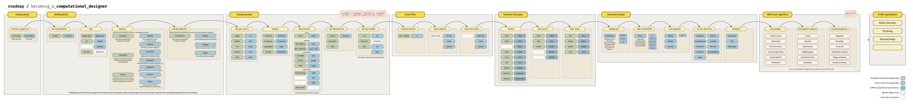

# Roadmap: becoming a computational designer

- [Download the full resolution roadmap](https://github.com/gramaziokohler/coding_architecture_hs23/raw/main/roadmap/roadmap.png)
- [Download Grasshopper file: comparing building blocks](compare_building_blocks.gh)

This roadmap provides guidence during the learning process,
to understand how much you've progressed and what are the skills and concepts
that you should master in order to move forward.

The roadmap is conceptually based on the definition of software by swiss
computer scientist Niklaus Wirth: "Datastructures + Algorithms = Programs".

Let's break down this definition into its components:

**Data Structures**:
- One of the most basic units of programs in a *Data* value, which exists first on its own.
- *Data* can be of different types: single values, multiple values, mapping types, etc.
- Data types are not just about categorizing  data but also determining the operations that can be performed on the data.

**Algorithms**:
- *Data* can be stored in a *Variable*. *Variables* are names (or labels) for data, and they can store and reference data values
- *Data* and *Variables* (and a few more things) can be combined using operators to create an *Expression*. *Expressions* return a value.
- *Expressions* can be composed into larger units called *Statements*. *Statements* which perform an action. Not all expressions are statements, but all statements contain expressions.
- *Statements* can be composed into larger units to create *Algorithms*, which is a step-by-step procedure for solving a problem.
- An *Algorithm* can be made re-usable if wrapped into a *Function*. 
- *Functions* can be composed into a *Class* together with *Variables* (attributes) so that data and behavior are bundled into one object.

Finally, once we have that, we can package our program into even larger units:
- *Functions* and *Classes* can be composed into a larger unit called a *Module*. A *Module* is simply a python file.
- *Modules* can be composed into a larger unit called *Package*. A *Package* is just a folder to organize related modules.
- *Packages* can be composed into a larger unit called *Library*  (or just app)
- *Libraries* are larger re-usable pieces of code. We can include (`import`) as many libraries as we want in our code.

